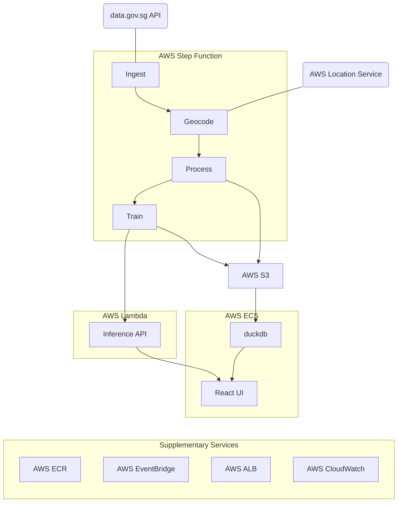

# HDB Resale Price Dashboard

A full-stack application that downloads, processes, and visualizes Singapore HDB resale flat transaction data.

## Architecture



## Tech Stack

- **ETL**: Python, Polars (LazyFrame), scikit-learn, OmegaConf
- **Infrastructure**: Terraform, AWS ECS (EC2), Step Functions, Lambda, S3, ECR
- **Dashboard**: Next.js, React, Recharts, Leaflet, DuckDB
- **Dev tools**: uv, ruff, pre-commit, pytest

## Project Structure

```
├── config/                 # OmegaConf YAML configuration
├── dashboard/              # Next.js React dashboard
│   └── src/
│       ├── app/            # Next.js App Router pages
│       ├── components/     # React components
│       └── lib/            # DuckDB client, utilities
├── docker/                 # Dockerfiles and entrypoints
├── src/
│   ├── etl/                # Python ETL pipeline
│   │   ├── ingest.py       # Data download from data.gov.sg
│   │   ├── geocode.py      # Address geocoding via Bing Maps
│   │   ├── process.py      # Data processing with Polars
│   │   ├── train.py        # ML model training
│   │   └── main.py         # CLI entrypoint
│   └── lambda/             # Python model inference API
├── terraform/              # AWS infrastructure as code
│   └── aws/                # Policies, step function definitions
│   ├── ecs.tf              # ECS cluster, task definitions, ALB
│   ├── step_functions.tf   # ETL pipeline
│   └── ...                 # VPC, S3, ECR, IAM, CloudWatch
├── tests/                  # Unit tests
├── .pre-commit.config.yaml # Pre-commit configuration
├── pyproject.toml          # Python project configuration
└── uv.lock                 # Python dependency lock
```

## Deployment Guide

1. Build all 3 Docker images and publish to a container registry like AWS ECR or DockerHub.
     1. `docker build --target hdb-resale-app-etl -f docker/Dockerfile.etl --push -t <REPO_URL> .`
     2. `docker build --target hdb-resale-app-dashboard-builder -f docker/Dockerfile.dashboard .`
     3. `docker build --target hdb-resale-app-dashboard -f docker/Dockerfile.dashboard --push -t <REPO_URL> .`
     4. `docker build --target hdb-resale-app-inference-lambda -f docker/Dockerfile.lambda --provenance=false --push -t <REPO_URL> .`
2. Make sure you provide the variables required in `variables.tf` (including the core AWS services such as ECR repos and ALB).
3. Run `cd terraform && terraform apply` to create/update the infrastructure.

## Additional Notes

1. The entire AWS infrastructure is managed by Terraform. But the core services (e.g. ECS) that span multiple services are managed centrally in a separate project, therefore not included in this repo.
2. The unit tests are automatically generated, and do not work currently.
